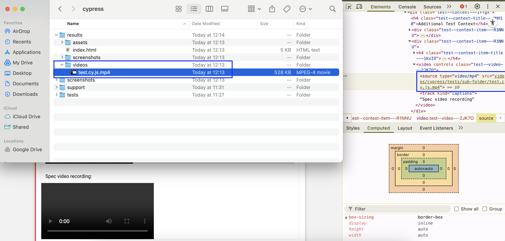
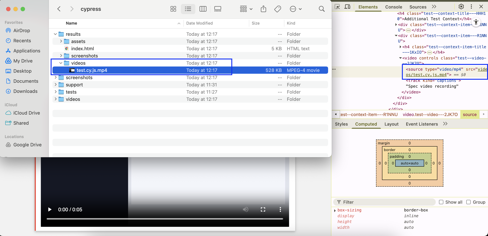

As reported in [issues/228](https://github.com/LironEr/cypress-mochawesome-reporter/issues/228), the url of the videos in the reports generated with [cypress-mochawesome-reporter](https://www.npmjs.com/package/cypress-mochawesome-reporter/) doesn't match the path of the videos in the file system.

To reproduce the issue, install the node dependencies and run the cypress tests:

```sh
npm ci
npm run cypress -- run
```



Note that this was working well in version `3.8.2`:


